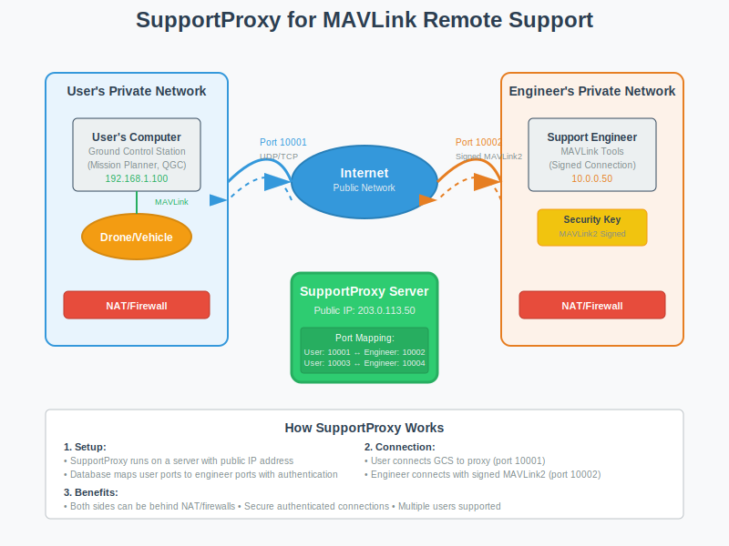

# SupportProxy — MAVLink relay for behind-NAT support

> This project was previously called UDPProxy. The repo, the binary, and most file/path names have been renamed; the old GitHub URL still redirects.

This is a UDP/TCP/WebSocket Proxy for MAVLink to facilitate remote support of ArduPilot users.

For more information on using the support proxy see https://support.ardupilot.org

## Features

- Both support engineer and user can be on private networks
- Supports many users running in parallel
- Uses MAVLink2 signed connections from the support engineer
- Uses normal UDP/TCP forwarding in users GCS
- Supports both TCP and UDP, including mixed connections
- Supports WebSocket and WebSocket+SSL TCP connections for both user
  and support engineer
- supports up to 8 simultaneous connections by support engineer

## How It Works



SupportProxy acts as a bridge between ArduPilot users and support engineers:

1. **User Side**: Connects their Ground Control Station to the proxy server (e.g., port 10001)
2. **Proxy Server**: Routes traffic between user and engineer ports with authentication
3. **Engineer Side**: Connects with MAVLink2 signed authentication (e.g., port 10002)

This allows both parties to be behind NAT/firewalls while maintaining
secure, authenticated connections.

Both sides can optionally use WebSocket+SSL to get a fully encrypted link.

## Building

### Prerequisites

```bash
# Ubuntu/Debian
sudo apt install libtdb-dev python3-tdb python3-venv gcc g++ git libssl-dev

```

### Get the source

```bash
# Clone the repository
git clone --recurse-submodules https://github.com/ArduPilot/SupportProxy.git
cd SupportProxy
```

### Python Virtual Environment Setup

It's recommended to use a Python virtual environment to install pymavlink:

```bash
# Create a virtual environment
python3 -m venv --system-site-packages venv

# Activate the virtual environment
source venv/bin/activate

# Install pymavlink in the virtual environment
pip install pymavlink
```

### Building SupportProxy

```bash
# Build everything (initializes submodules, generates headers, compiles)
make

# Or see all available options
make help
```

**Note: Remember to activate the virtual environment whenever you need to use pymavlink**

## Configuration and Usage

### Initial Setup

SupportProxy should be run on a machine with a public IP address or through an internet domain. Initialize the database once:

```bash
# Initialize the key database
./keydb.py initialise

# Or with virtual environment
source venv/bin/activate
python3 keydb.py initialise
```

### Adding Users

Add support engineer and user port pairs:

```bash
# Add a user: USER_PORT ENGINEER_PORT NAME PASSPHRASE
./keydb.py add 10001 10002 'Support1' MySecurePassPhrase

# Convention examples:
# Even ports for users, odd for engineers:
./keydb.py add 10004 10005 'Support2' AnotherPassPhrase

# Or use port offsets:
./keydb.py add 11001 21001 'Support3' ThirdPassPhrase
```

### Running the Proxy

```bash
# Start the proxy (runs in foreground)
./supportproxy

# Check if running in another terminal
pgrep supportproxy
```

### Supporting WebSocket + SSL

To support SSL encrypted links for WebSocket connections (both for
user connections and support engineer connections) you will need to
provide a fullchain.pem and privkey.pem file in the directory where
you start supportproxy. These files must be readable by supportproxy. SSL
support has been tested with Let's Encrypt certificates. Note that
when you renew your certificates you will need to update the files in
this directory, or use symlinks to the system certificates.

### Automatic Startup

#### The cron way

For production deployment, you can use cron for automatic startup and restart:

```bash
# Edit crontab
crontab -e

# Add these lines:
*/1 * * * * $HOME/SupportProxy/start_proxy.sh
@reboot $HOME/SupportProxy/start_proxy.sh
```

The `start_proxy.sh` script will:
- Check if supportproxy is already running
- Start it if not running
- Log output to `proxy.log` and cron activity to `cron.log`

### Monitoring

```bash
# Check proxy status
pgrep supportproxy

# View logs
tail -f proxy.log      # Proxy output
tail -f cron.log       # Cron activity

# List current users
./keydb.py list

# Check active connections
netstat -ln | grep ":1000[0-9]"
```

## Docker Usage

SupportProxy can also be run using Docker for easier deployment and management.

### Building the Docker Image

```bash
docker build -f docker/Dockerfile -t ap-supportproxy .
```

### Running with Docker

```bash
# Create a volume for persistent data (keys.tdb and logs)
docker volume create supportproxy-data

# Initialize the database (first time only)
docker run --rm -v supportproxy-data:/app/data -it ap-supportproxy keydb.py initialise

# Add users to the database
docker run --rm -v supportproxy-data:/app/data -it ap-supportproxy keydb.py add 10001 10002 'Support1' MySecurePassPhrase

# Run the UDP proxy as deamon
docker run -d --name ap-supportproxy -v supportproxy-data:/app/data -p 10001-10100:10001-10100 ap-supportproxy
```

Adapt exposed port according to your usage.

### Managing the Database with Docker

The Docker container includes an intelligent entrypoint that automatically handles keydb.py commands:

```bash
# All keydb.py operations work directly:
docker run --rm -v supportproxy-data:/app/data -it ap-supportproxy keydb.py list
docker run --rm -v supportproxy-data:/app/data -it ap-supportproxy keydb.py add PORT1 PORT2 Name PassPhrase
docker run --rm -v supportproxy-data:/app/data -it ap-supportproxy keydb.py remove PORT2
docker run --rm -v supportproxy-data:/app/data -it ap-supportproxy keydb.py setname PORT2 NewName
docker run --rm -v supportproxy-data:/app/data -it ap-supportproxy keydb.py setpass PORT2 NewPassPhrase
```

### Viewing Logs and Monitoring

When running SupportProxy in Docker, you can monitor logs and status using these commands:

```bash
# View real-time logs from the running container
docker logs -f ap-supportproxy

# View last 100 lines of logs
docker logs --tail 100 ap-supportproxy

# View logs with timestamps
docker logs -t ap-supportproxy

# Check container status
docker ps | grep ap-supportproxy

# Check container resource usage
docker stats ap-supportproxy

# Access container shell for debugging
docker exec -it ap-supportproxy bash

# View logs inside the container (if available)
docker exec ap-supportproxy tail -f /app/data/proxy.log
```

## Database Management

### keydb.py Commands

The `keydb.py` script provides comprehensive database management:

```bash
# Initialize database (first time only)
./keydb.py initialise

# List all users and their status
./keydb.py list

# Add new user
./keydb.py add PORT1 PORT2 Name PassPhrase

# Remove user
./keydb.py remove PORT2

# Modify existing users
./keydb.py setname PORT2 NewName           # Change name
./keydb.py setpass PORT2 NewPassPhrase     # Change passphrase
./keydb.py setport1 PORT2 NewPORT1         # Change user port

# Reset signing replay-protection timestamp (e.g. after clock skew)
./keydb.py resettimestamp PORT2

# Flag bits (used by the web admin UI to mark admins)
./keydb.py setflag PORT2 admin             # Grant admin to entry
./keydb.py clearflag PORT2 admin           # Revoke admin from entry
./keydb.py flags PORT2                     # Show flags currently set

# Examples:
./keydb.py add 10006 10007 'Engineering' SecurePass123
./keydb.py setname 10007 'QA Team'
./keydb.py remove 10007
```

### Database Notes

- **Automatic Port Listening**: When users are added, supportproxy automatically starts listening on new ports without restart
- **Port Conflicts**: The system prevents duplicate port assignments
- **Persistent Storage**: Database is stored in `keys.tdb` file
- **Backup**: Regularly backup the `keys.tdb` file for disaster recovery

### Security Considerations

- **Passphrase Strength**: Use strong, unique passphrases for each user
- **Port Range**: Consider using non-standard port ranges to avoid conflicts
- **Firewall**: Configure firewall rules to allow only necessary ports
- **Access Control**: Limit access to the server and keydb.py script

## Web Admin UI

The `webadmin/` directory contains a small Flask app that lets users
manage their own entry through the browser, and lets users with the
`admin` flag manage every entry. It writes to the same `keys.tdb` the
running `supportproxy` reads, so changes go live within ~5 seconds with no
proxy restart.

### Roles and login

- Anyone can log in by entering **either `port1` or `port2`** plus the
  passphrase set with `keydb.py`.
- Users with `KEY_FLAG_ADMIN` set on their entry get the admin UI (list
  all entries, edit any, grant/revoke admin, add/delete entries).
- Everyone else gets the self-service UI (rename their own entry, rotate
  their own passphrase, reset their signing timestamp).

### Install dependencies

```bash
source venv/bin/activate
pip install Flask Flask-WTF gunicorn
```

### Bootstrap the first admin

The web UI has no out-of-band admin; you promote an existing entry to
admin from the CLI on the server:

```bash
./keydb.py setflag 10007 admin
```

That entry can then log in to the web UI as an admin and grant the flag
to others through the web interface.

### Run standalone

```bash
# Set a stable secret so sessions survive restarts
export WEBADMIN_SECRET_KEY=$(python -c 'import secrets; print(secrets.token_hex(32))')

# Path to keys.tdb (defaults to ./keys.tdb relative to cwd)
export WEBADMIN_KEYDB_PATH=/path/to/proxy/keys.tdb

# Bind to localhost or a public address. Use --certfile/--keyfile for TLS.
gunicorn -w 2 -b 127.0.0.1:8080 webadmin.wsgi:application
```

For local HTTP-only development, also set `WEBADMIN_INSECURE_COOKIES=1`
so the session cookie is sent without the `Secure` flag. **Do not set
this in production.**

For local development from `test/` (or any directory containing a
`keys.tdb`), there's a helper that wires the env vars up for you:

```bash
cd test
../scripts/run_webui.sh                     # http://127.0.0.1:8080
WEBADMIN_PORT=9000 ../scripts/run_webui.sh
WEBADMIN_TLS=1 ../scripts/run_webui.sh      # uses fullchain.pem / privkey.pem in cwd
```

It uses `gunicorn` if available and falls back to Flask's dev server
otherwise.

### Run behind Apache (`ProxyPass`)

The intended deployment is for the web UI to listen on
`127.0.0.1:8080` and have an existing Apache vhost forward an
externally-managed URL to it. Apache terminates TLS; the app trusts
`X-Forwarded-*` headers from Apache when `WEBADMIN_BEHIND_PROXY=1`:

```apache
<VirtualHost *:443>
    ServerName  support.example.org
    SSLEngine on
    SSLCertificateFile      /etc/letsencrypt/live/support.example.org/fullchain.pem
    SSLCertificateKeyFile   /etc/letsencrypt/live/support.example.org/privkey.pem

    ProxyPreserveHost On
    ProxyPass        /admin/ http://127.0.0.1:8080/
    ProxyPassReverse /admin/ http://127.0.0.1:8080/
    RequestHeader set X-Forwarded-Prefix /admin
    RequestHeader set X-Forwarded-Proto https
</VirtualHost>
```

Required Apache modules: `mod_proxy`, `mod_proxy_http`, `mod_headers`,
`mod_ssl`. Then run gunicorn with the proxy flag set:

```bash
export WEBADMIN_BEHIND_PROXY=1
export WEBADMIN_SECRET_KEY=...
export WEBADMIN_KEYDB_PATH=/path/to/proxy/keys.tdb
gunicorn -w 2 -b 127.0.0.1:8080 webadmin.wsgi:application
```

The browser hits `https://support.example.org/admin/` and Apache forwards
to the local gunicorn. URL-building inside the app uses
`X-Forwarded-Prefix` so links resolve correctly under `/admin/`.

### Per-host customisation: `webui.json`

A `webui.json` next to `keys.tdb` (i.e. `~/proxy/webui.json` for the
default layout) is read on every web app startup. All keys are
optional:

```json
{
  "title": "ArduPilot Support Proxy",
  "mode":  "standalone",
  "host":  "127.0.0.1",
  "port":  8080
}
```

| Key | Effect |
|---|---|
| `title` | Replaces the default `SupportProxy admin` site name in the nav and `<title>` |
| `mode` | `standalone` — `start_proxy.sh` (re)spawns the web UI on the configured `host:port`. `apache` — sets `BEHIND_PROXY=1` so the app honours `X-Forwarded-*`; the launching is then someone else's job (`mod_wsgi`, a systemd unit, etc.) |
| `host` | Listen address for `mode: standalone`. Defaults to `127.0.0.1` (loopback only). Set to `0.0.0.0` to listen on every interface — only safe behind a firewall and/or a TLS terminator. |
| `port` | TCP port for `mode: standalone`. Front with TLS / a reverse proxy in production. |

When `mode: standalone`, the cron entry from "Automatic Startup" is
enough — `start_proxy.sh` checks `webui.json`, generates a stable
`~/proxy/.webadmin_secret`, and (re)launches the app on every tick if
nothing is running. If `~/proxy/fullchain.pem` and
`~/proxy/privkey.pem` are present (the same cert pair supportproxy uses
for WSS), the standalone web UI auto-serves over HTTPS using them and
keeps the session cookie's `Secure` flag set; otherwise it falls back
to plain HTTP.

### Configuration reference

All settings can be overridden via environment variables:

| Variable | Default | Purpose |
|---|---|---|
| `WEBADMIN_SECRET_KEY` | random per process | Flask session + CSRF signing key. Set a stable value in production. |
| `WEBADMIN_KEYDB_PATH` | `keys.tdb` (cwd-relative) | Path to the TDB file. |
| `WEBADMIN_BEHIND_PROXY` | unset | Set to `1` when fronted by Apache to honour `X-Forwarded-*` headers. |
| `WEBADMIN_INSECURE_COOKIES` | unset | Set to `1` only for local HTTP dev; allows session cookie without `Secure` flag. |

## Troubleshooting

### Common Issues

**Build Errors:**
```bash
# Missing dependencies
sudo apt install libtdb-dev python3-tdb build-essential git libssl-dev

# Submodule issues
git submodule update --init --recursive --force

# Clean rebuild
make distclean && make
```

**Runtime Issues:**
```bash
# Check if ports are in use
netstat -ln | grep ":10001"

# Check database
./keydb.py list

# Restart proxy
pkill supportproxy && ./supportproxy

# Check logs
tail -f proxy.log
```

**Permission Issues:**
```bash
# Make scripts executable
chmod +x keydb.py start_proxy.sh

# Check database permissions
ls -la keys.tdb
```

### Debug Mode

```bash
# Check system logs
journalctl -f | grep supportproxy
```

## Testing

The test suite covers UDP/TCP connection scenarios, the `keydb.py` CLI,
and the web admin UI (auth, role guards, CSRF, concurrent writes).

```bash
# Run everything (builds supportproxy, runs all three phases)
./scripts/run_tests.sh

# Run in parallel via pytest-xdist (-j N workers, each with its own
# tmpdir + port pair so they don't collide)
./scripts/run_tests.sh -j 4

# List every test without running anything
./scripts/run_tests.py --list

# Run specific tests (any pytest selector works). --no-build skips the
# make step for fast iteration.
./scripts/run_tests.py --no-build tests/webadmin/
./scripts/run_tests.py --no-build tests/test_connections.py::TestUDPConnections
./scripts/run_tests.py --no-build -j 4 tests/webadmin/test_admin.py::TestAdminEdit::test_cannot_revoke_last_admin
```

When invoked with no test selectors, the runner builds and then runs
three separate pytest invocations (connection tests, authentication
tests, webadmin tests) — they're kept separate because each phase has
different cwd / `keys.tdb` / process expectations. With selectors, it
runs one pytest invocation against exactly what you passed.

## Contributing

1. **Code Style**: Follow existing C++ and Python conventions
2. **Testing**: Run the test suite before submitting changes
3. **Documentation**: Update README for new features
4. **Compatibility**: Ensure changes work with existing databases

## License

SupportProxy is licensed under the GNU General Public License version 3 or later.

See `COPYING.txt` for full license terms.
